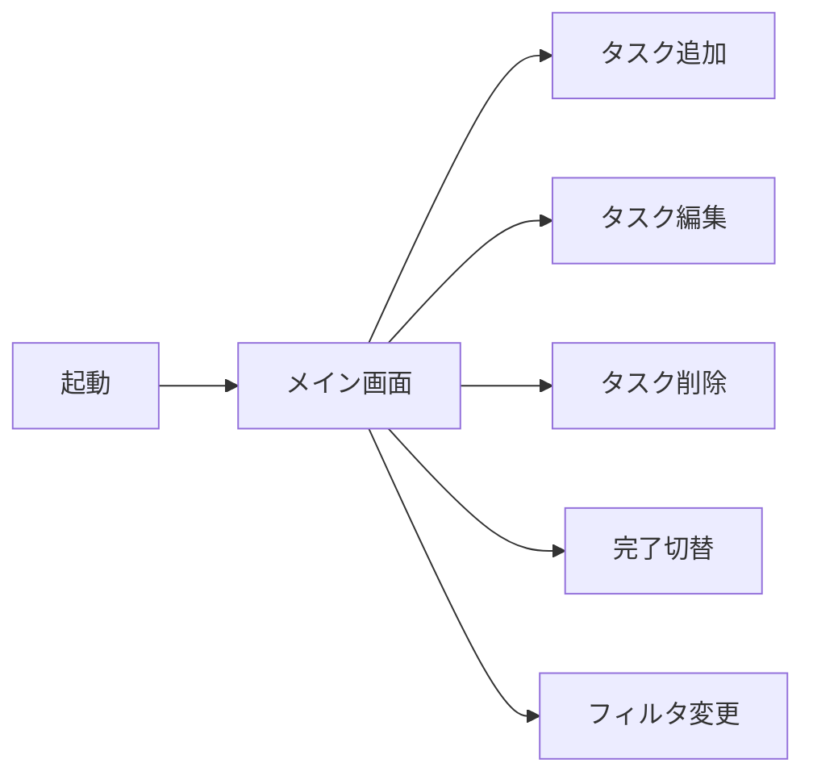
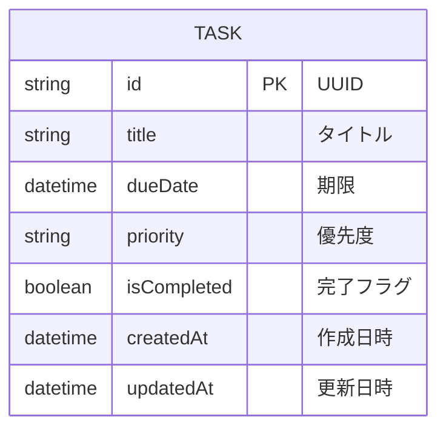
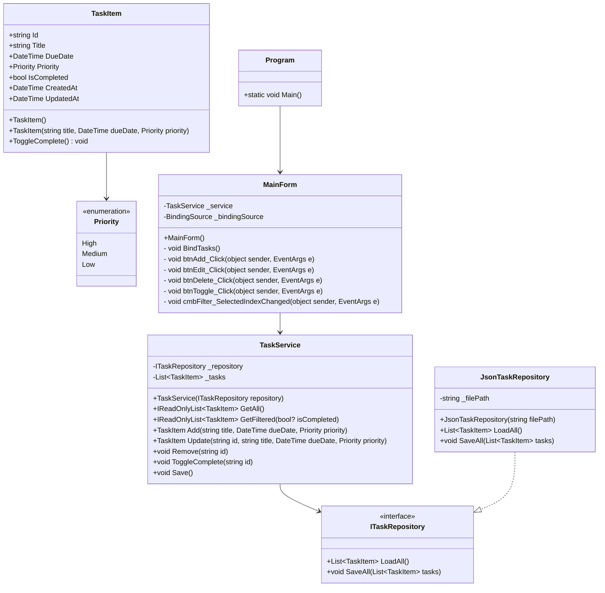
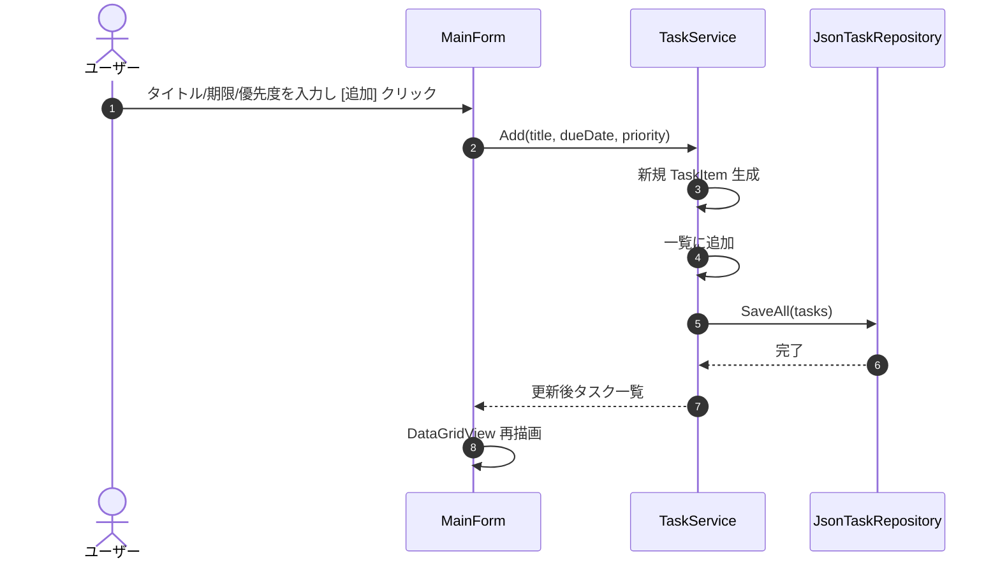
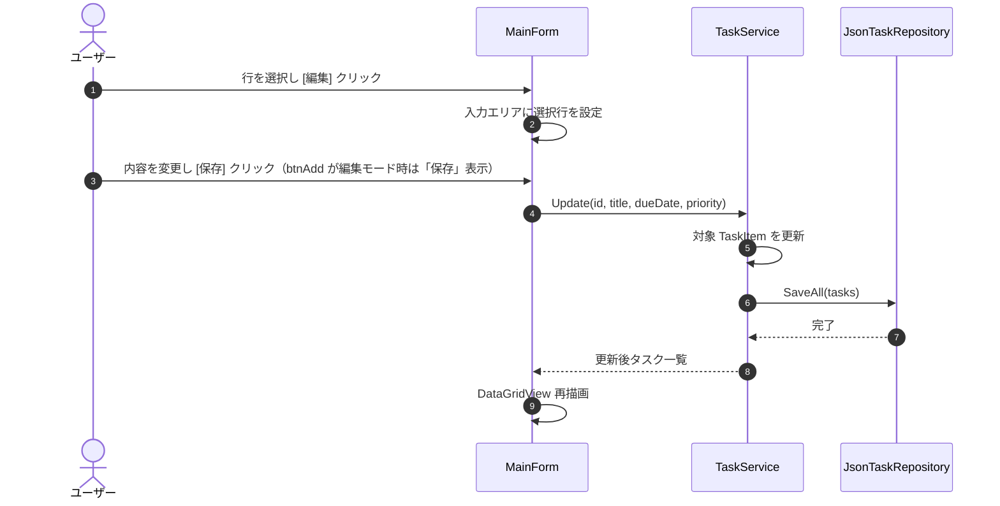
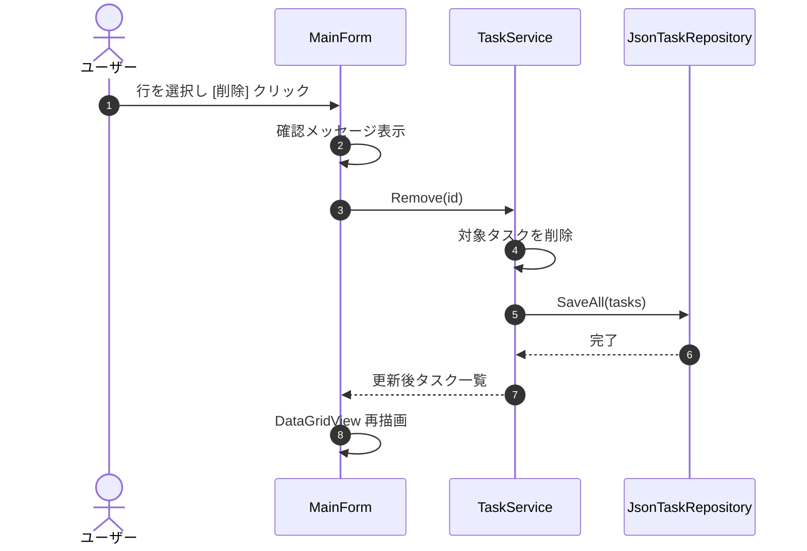
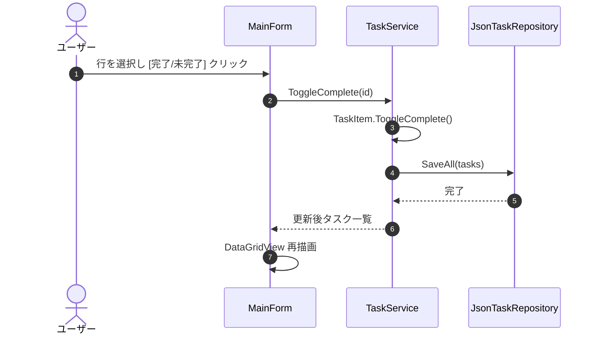

# ToDo 管理画面 設計書

## 1. 概要

本設計書は、`.NET Framework 4.8` + `Windows Forms` で構築する ToDo 管理画面の設計を定義する。

## 2. 前提条件

- 実行環境: Windows Server 2022
- ターゲットフレームワーク: .NET Framework 4.8
- 言語: C# 7.3
- ビルドツール: MSBuild 4.0
- テストフレームワーク: NUnit 3.14.0
- データ永続化: ローカル JSON ファイル (`tasks.json`)

## 3. 用語

| 用語 | 説明 |
|------|------|
| タスク | ToDo 管理の対象となる 1 件の作業 |
| ステータス | タスクの状態。`未完了` または `完了` |
| 優先度 | タスクの重要度。`高` / `中` / `低` |

## 4. 機能一覧

| ID | 機能名 | 説明 |
|----|--------|------|
| F01 | タスク一覧表示 | 登録済みタスクを一覧で表示する |
| F02 | タスク追加 | タイトル、期限、優先度を入力して新規タスクを追加する |
| F03 | タスク編集 | 選択したタスクの内容を更新する |
| F04 | タスク削除 | 選択したタスクを削除する |
| F05 | 完了切替 | 選択したタスクの完了/未完了を切り替える |
| F06 | ステータスフィルタ | 全て/未完了/完了で一覧を絞り込む |
| F07 | データ保存 | タスクを JSON ファイルに保存する |
| F08 | データ読み込み | 起動時に JSON ファイルからタスクを読み込む |

## 5. 画面構成

### 5.1 画面遷移図

本画面は単一画面で構成する。追加・編集は同一画面内の入力エリアで行う。



### 5.2 画面レイアウト

```
+--------------------------------------------------+
|  ToDo 管理画面                                   |
+--------------------------------------------------+
| タイトル [____________] 期限 [__/__/____] 優先度 [v] [追加] [キャンセル] |
+--------------------------------------------------+
| フィルタ [全て v]                                |
+--------------------------------------------------+
| # | タイトル | 期限 | 優先度 | ステータス | 完了 |
|---|----------|------|--------|------------|------|
| 1 | 買い物   | 7/15 | 中     | 未完了     | [ ]  |
| 2 | 報告書   | 7/12 | 高     | 完了       | [v]  |
+--------------------------------------------------+
|              [編集] [削除] [完了/未完了に戻す]   |
+--------------------------------------------------+
```

### 5.3 コントロール定義

| コントロール名 | 種別 | 説明 |
|----------------|------|------|
| `txtTitle` | TextBox | タスクのタイトル入力 |
| `dtpDueDate` | DateTimePicker | タスクの期限入力 |
| `cmbPriority` | ComboBox | 優先度選択（高/中/低） |
| `btnAdd` | Button | 新規タスク追加。編集モード時は「保存」に切り替わる |
| `btnCancel` | Button | 編集/入力をキャンセルし入力エリアをクリア |
| `cmbFilter` | ComboBox | ステータスフィルタ（全て/未完了/完了） |
| `dgvTasks` | DataGridView | タスク一覧表示 |
| `btnEdit` | Button | 選択行を編集モードにする |
| `btnDelete` | Button | 選択行を削除 |
| `btnToggle` | Button | 選択行の完了/未完了を切り替え |

## 6. データモデル

### 6.1 ER 図



### 6.2 エンティティ定義

| プロパティ | 型 | 説明 |
|------------|-----|------|
| `Id` | `string` | UUID。タスクの一意識別子 |
| `Title` | `string` | タスクのタイトル。最大 100 文字 |
| `DueDate` | `DateTime` | 期限。未設定の場合 `DateTime.MinValue` |
| `Priority` | `Priority` 列挙型 | 高/中/低 |
| `IsCompleted` | `bool` | 完了フラグ |
| `CreatedAt` | `DateTime` | 作成日時 |
| `UpdatedAt` | `DateTime` | 更新日時 |

### 6.3 列挙型

```csharp
public enum Priority
{
    High,
    Medium,
    Low
}
```

### 6.4 JSON ファイル形式

```json
{
  "tasks": [
    {
      "id": "...",
      "title": "買い物",
      "dueDate": "2026-07-15T00:00:00",
      "priority": "Medium",
      "isCompleted": false,
      "createdAt": "2026-07-10T05:00:00",
      "updatedAt": "2026-07-10T05:00:00"
    }
  ]
}
```

## 7. クラス設計

### 7.1 クラス図



### 7.2 クラス責務

| クラス | 責務 |
|--------|------|
| `TaskItem` | タスクのエンティティ。不変条件の保持と完了切替 |
| `ITaskRepository` | タスクの永続化 I/F |
| `JsonTaskRepository` | JSON ファイルによる永続化実装 |
| `TaskService` | タスクの CRUD およびフィルタロジック |
| `MainForm` | Windows Forms 画面。ユーザー入力と `TaskService` の呼び出し |
| `Program` | アプリケーションのエントリポイント |

## 8. 処理フロー

### 8.1 タスク追加



### 8.2 タスク編集



### 8.3 タスク削除



### 8.4 完了切替



## 9. 入出力定義

### 9.1 入力

| 入力項目 | 型 | 制約 |
|----------|-----|------|
| タイトル | `string` | 必須、最大 100 文字 |
| 期限 | `DateTime` | 任意 |
| 優先度 | `Priority` | 必須 |

### 9.2 出力

| 出力項目 | 型 | 説明 |
|----------|-----|------|
| タスク一覧 | `IReadOnlyList<TaskItem>` | 画面に表示されるタスクのリスト |
| JSON ファイル | `tasks.json` | タスクの永続化ファイル |

## 10. エラーハンドリング

| エラー | 発生箇所 | 対応 |
|--------|----------|------|
| タイトル未入力 | `MainForm.btnAdd_Click` | メッセージボックスで警告 |
| タスク未選択 | `MainForm.btnEdit_Click` / `btnDelete_Click` | メッセージボックスで警告 |
| ファイル読み込み失敗 | `JsonTaskRepository.LoadAll` | 空リストを返し、エラーを無視（初回起動時） |
| ファイル書き込み失敗 | `JsonTaskRepository.SaveAll` | メッセージボックスでエラー表示 |

## 11. テスト方針

### 11.1 単体テスト（UT）

- 対象: `TaskService` と `JsonTaskRepository`
- フレームワーク: NUnit 3.14.0
- 内容:
  - タスク追加/更新/削除/完了切替の動作
  - フィルタ（全て/未完了/完了）
  - JSON ファイルの保存/読み込み
  - リポジトリはテスト用の一時ファイルパスを使用

### 11.2 E2E テスト

- 対象: `MainForm` + `TaskService`
- 方法: 手動テスト手順書化
- 内容: 画面操作による CRUD およびデータ永続化の確認

## 12. 作業時間

| 工程 | 開始（UTC） | 終了（UTC） | 所要時間 |
|------|------------|------------|----------|
| 調査・影響分析 | 2026-07-10 05:34:00 | 2026-07-10 05:41:36 | 00:07:36 |
| 設計書作成 | 2026-07-10 05:42:16 | 2026-07-10 05:42:54 | 00:00:38 |
| 実装（UT 含む） | 2026-07-10 05:44:33 | 2026-07-10 05:52:14 | 00:07:41 |
| E2E テスト仕様書作成 | 2026-07-10 05:52:57 | 2026-07-10 05:53:03 | 00:00:06 |
