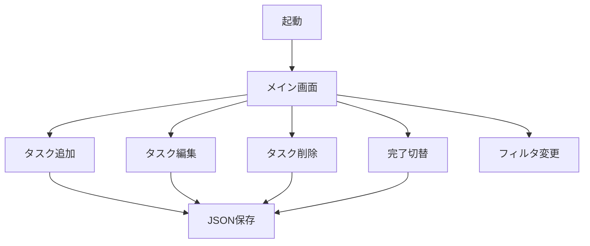

# ToDo 管理画面 E2E テスト仕様書

## 1. 目的

本書は、ToDo 管理画面の End-to-End テスト手順を定義します。手動で画面を操作し、機能が正しく動作することを確認します。

## 2. テスト環境

- OS: Windows 10 / Windows 11 / Windows Server 2022
- ランタイム: .NET Framework 4.8
- 実行ファイル: `src/TodoApp.WinForms/bin/Debug/TodoApp.WinForms.exe`
- テストデータファイル: `tasks.json`（実行ファイルと同じディレクトリに作成）

## 3. テスト前準備

1. ソリューションをビルドします。
   ```cmd
   MSBuild TodoApp.sln /p:Configuration=Debug /p:Platform="Any CPU"
   ```
2. 実行ファイルを起動します。
   ```
   src\TodoApp.WinForms\bin\Debug\TodoApp.WinForms.exe
   ```
3. テスト開始前に、実行ファイルと同じディレクトリの `tasks.json` が存在する場合は削除します。

## 4. テストケース

### TC-001 タスクの追加

| 項目 | 内容 |
|------|------|
| 目的 | 新しいタスクが一覧に追加され、JSON ファイルに保存されることを確認する |
| 前提条件 | アプリを起動し、`tasks.json` が存在しないこと |

#### 手順

1. タイトル欄に「買い物」を入力する
2. 期限を `2026/07/15` に設定する
3. 優先度を「中」に設定する
4. [追加] ボタンをクリックする
5. 一覧に「買い物」が表示されることを確認する
6. アプリを終了し、`tasks.json` が作成されていることを確認する

#### 期待結果

- 一覧に「買い物」「2026/07/15」「中」「未完了」が表示される
- `tasks.json` にタスクが保存される

### TC-002 タスクの編集

| 項目 | 内容 |
|------|------|
| 目的 | 既存タスクの内容が更新されることを確認する |
| 前提条件 | TC-001 で「買い物」タスクが追加されていること |

#### 手順

1. 一覧から「買い物」の行を選択する
2. [編集] ボタンをクリックする
3. タイトル欄を「買い物 → 変更済み」に変更する
4. 優先度を「高」に変更する
5. [追加] ボタン（編集モード時は「保存」表示）をクリックする

#### 期待結果

- 一覧のタイトルが「買い物 → 変更済み」、優先度が「高」に更新される
- ステータスは「未完了」のままである

### TC-003 タスクの完了切替

| 項目 | 内容 |
|------|------|
| 目的 | タスクの完了/未完了が切り替わることを確認する |
| 前提条件 | TC-001 または TC-002 でタスクが存在すること |

#### 手順

1. 一覧から対象タスクの行を選択する
2. [完了/未完了] ボタンをクリックする
3. 一覧の「完了」チェックボックスが ON になり、ステータスが「完了」になることを確認する
4. 再度 [完了/未完了] ボタンをクリックする

#### 期待結果

- 1 回目のクリックでステータスが「完了」に変わる
- 2 回目のクリックでステータスが「未完了」に戻る

### TC-004 タスクの削除

| 項目 | 内容 |
|------|------|
| 目的 | 選択したタスクが削除されることを確認する |
| 前提条件 | タスクが 1 件以上登録されていること |

#### 手順

1. 一覧から削除するタスクの行を選択する
2. [削除] ボタンをクリックする
3. 確認ダイアログで [はい] を選択する

#### 期待結果

- 一覧から対象タスクが削除される
- `tasks.json` からも削除される

### TC-005 フィルタ機能

| 項目 | 内容 |
|------|------|
| 目的 | ステータスによるフィルタリングが正しく動作することを確認する |
| 前提条件 | 未完了タスクと完了タスクがそれぞれ 1 件以上存在すること |

#### 手順

1. 未完了タスクを 1 件、完了タスクを 1 件追加する
2. フィルタの ComboBox を「未完了」に変更する
3. 一覧に未完了タスクのみ表示されることを確認する
4. フィルタを「完了」に変更する
5. 一覧に完了タスクのみ表示されることを確認する
6. フィルタを「全て」に変更する

#### 期待結果

- 「未完了」選択時は未完了タスクのみ表示される
- 「完了」選択時は完了タスクのみ表示される
- 「全て」選択時は全タスクが表示される

### TC-006 データ永続化

| 項目 | 内容 |
|------|------|
| 目的 | タスクが JSON ファイルに保存され、再起動後も読み込まれることを確認する |
| 前提条件 | タスクが 1 件以上登録されていること |

#### 手順

1. タスクを追加する
2. アプリを終了する
3. `tasks.json` の内容を確認する
4. アプリを再度起動する

#### 期待結果

- 再起動後、終了前に追加したタスクが一覧に表示される
- `tasks.json` の内容が正しく読み込まれている

### TC-007 入力バリデーション

| 項目 | 内容 |
|------|------|
| 目的 | タイトル未入力時にエラーが表示されることを確認する |
| 前提条件 | アプリが起動していること |

#### 手順

1. タイトル欄を空にする
2. [追加] ボタンをクリックする

#### 期待結果

- 「タイトルを入力してください。」というメッセージボックスが表示される
- タスクが追加されない

### TC-008 未選択時の操作

| 項目 | 内容 |
|------|------|
| 目的 | タスク未選択時に編集/削除/完了切替ボタンを押した際の挙動を確認する |
| 前提条件 | 一覧にタスクがないか、選択されていない状態であること |

#### 手順

1. 一覧でタスクが選択されていない状態にする
2. [編集] ボタンをクリックする
3. メッセージボックスを閉じる
4. [削除] ボタンをクリックする
5. メッセージボックスを閉じる
6. [完了/未完了] ボタンをクリックする

#### 期待結果

- それぞれの操作で「タスクを選択してください」という警告メッセージが表示される

## 5. 画面遷移



## 6. 非機能確認

| 項目 | 確認内容 |
|------|----------|
| 画面サイズ | 800x600 程度でウィンドウが表示されること |
| レスポンス | 各ボタン押下後、1 秒以内に一覧が更新されること |

## 7. 作業時間

| 工程 | 開始（UTC） | 終了（UTC） | 所要時間 |
|------|------------|------------|----------|
| E2E テスト仕様書作成 | 2026-07-10 05:52:57 | 2026-07-10 05:53:03 | 00:00:06 |
