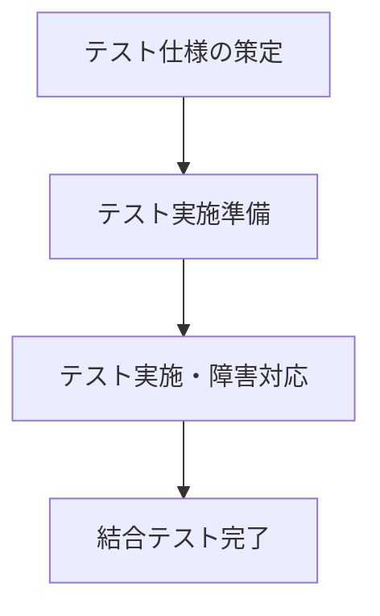
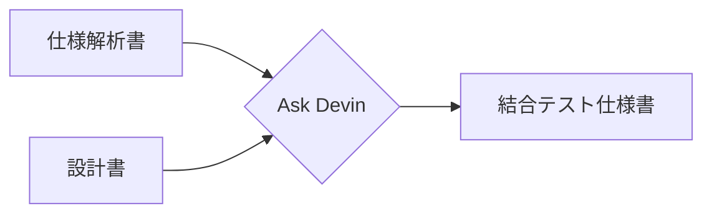
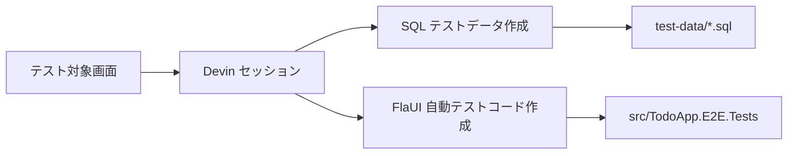
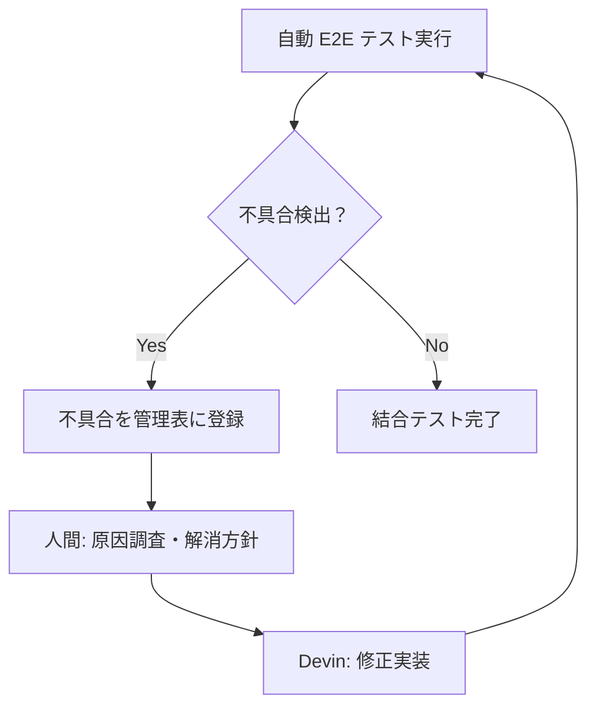
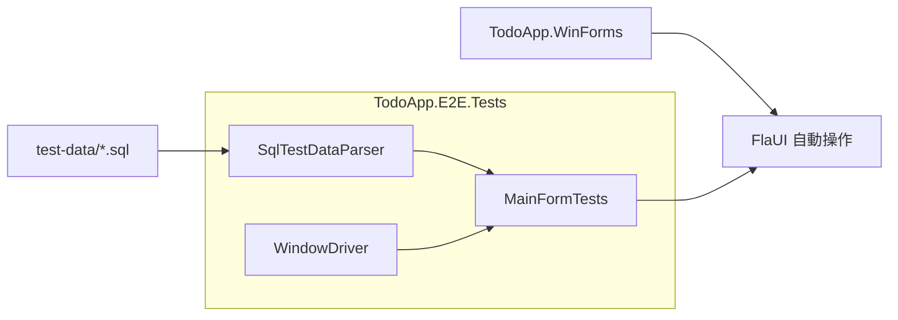

# 結合テスト（自動 E2E テスト）プロセス

## 1. 目的

本書は、Devin を主軸とした ToDo 管理画面の結合テスト（End-to-End テスト）を作成・実行するプロセスを定義します。

## 2. 前提条件

- OS: Windows 10 / Windows 11 / Windows Server 2022
- ランタイム: .NET Framework 4.8
- 自動化ツール: FlaUI 3.2（Windows Forms 操作用）
- テストフレームワーク: NUnit 3.14
- テストデータ形式: SQL ファイル
- 実行対象: `src/TodoApp.WinForms/bin/Debug/TodoApp.WinForms.exe`

## 3. 結合テストプロセス

### 3.1 プロセス概要



### 3.2 各ステップの詳細

#### ステップ 1: テスト仕様の策定

- 入力: 仕様解析書（md）と設計書（md）
- 作業: Ask Devin によるテストケースの抽出
- 出力: 結合テスト仕様書（md）



#### ステップ 2: テスト実施準備

- 作業: テストデータの作成
- 出力: SQL 形式の DB テストデータファイル
- 作業: 自動テストコードの作成
- 出力: 自動 E2E テストプロジェクト



#### ステップ 3: テスト実施・障害対応

- 作業: Devin セッションで自動 E2E テストを実行
- 不具合検出時:
  1. 不具合を管理表に登録
  2. Devin が修正対応（ソースコード・テストコード）
  3. 修正後、再テスト
  4. シナリオが通るまで反復
- 補足: 原因調査と解消方針の検討は人間が実施



実装済みのテスト結果例:

```text
Test Count: 8, Passed: 8, Failed: 0, Warnings: 0, Inconclusive: 0, Skipped: 0
```

## 4. テストデータ管理

### 4.1 SQL テストデータ

テストデータは `test-data/` 配下に SQL ファイルとして管理します。
SQL ファイルはセッションから直接ダウンロード可能です。

| ファイル | 用途 |
|----------|------|
| `test-data/e2e-tasks.sql` | 結合テスト用の初期タスクデータ |

### 4.2 SQL ファイル形式

```sql
-- テストデータ例
INSERT INTO Tasks (Id, Title, DueDate, Priority, IsCompleted, CreatedAt, UpdatedAt)
VALUES ('1', '買い物', '2026-07-15T00:00:00', 'Medium', 0, '2026-07-10T00:00:00', '2026-07-10T00:00:00');

INSERT INTO Tasks (Id, Title, DueDate, Priority, IsCompleted, CreatedAt, UpdatedAt)
VALUES ('2', 'レポート', '2026-07-20T00:00:00', 'High', 1, '2026-07-10T00:00:00', '2026-07-10T00:00:00');
```

## 5. 自動 E2E テスト構成

### 5.1 プロジェクト構成



### 5.2 実行手順

```cmd
# 1. パッケージの復元
nuget restore TodoApp.sln

# 2. ソリューションのビルド
MSBuild TodoApp.sln /p:Configuration=Debug /p:Platform="Any CPU"

# 3. E2E テストの実行
packages\NUnit.ConsoleRunner.3.16.3\tools\nunit3-console.exe src\TodoApp.E2E.Tests\bin\Debug\TodoApp.E2E.Tests.dll --result=e2e-test-results.xml
```

2026-07-10 時点の実行結果:

- テスト数: 8
- 結果: **Passed 8 / Failed 0**
- 単体テストも含めたソリューションビルドは成功

## 6. 評価観点

| 観点 | 内容 |
|------|------|
| 機能網羅性 | 追加/編集/削除/完了切替/フィルタ/永続化/バリデーションを網羅 |
| 自動化 | Devin セッション内で NUnit + FlaUI により自動実行 |
| 再現性 | SQL テストデータにより初期状態を固定し再現 |
| 障害追跡 | 不具合検出時は管理表へ登録し、修正→再テストを繰り返す |

## 7. 作業時間

| 工程 | 開始（UTC） | 終了（UTC） | 所要時間 |
|------|------------|------------|----------|
| 結合テストプロセス手順書作成 | 2026-07-10 05:54:00 | 2026-07-10 05:57:00 | 00:03:00 |
| SQL テストデータ作成 | 2026-07-10 05:57:00 | 2026-07-10 06:00:00 | 00:03:00 |
| 自動 E2E テストプロジェクト追加 | 2026-07-10 06:00:00 | 2026-07-10 07:22:00 | 01:22:00 |
| E2E テスト実行 | 2026-07-10 07:22:00 | 2026-07-10 07:26:00 | 00:04:00 |
